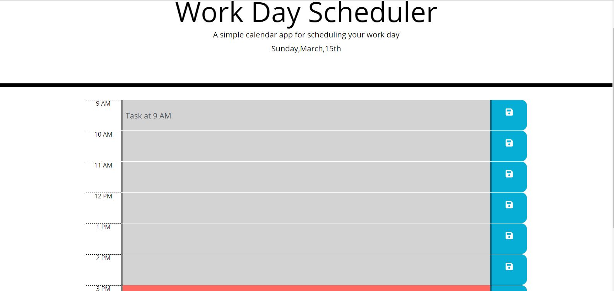
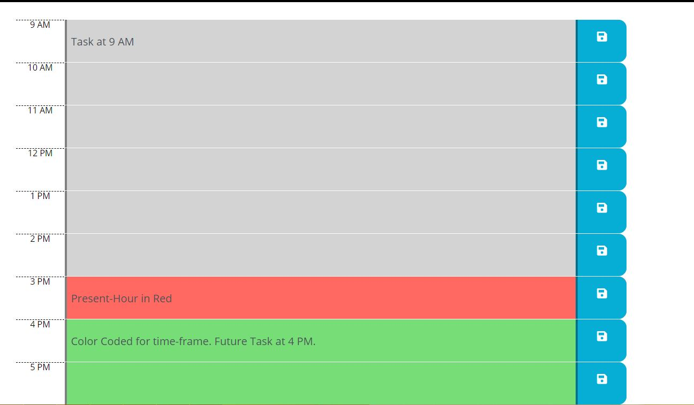
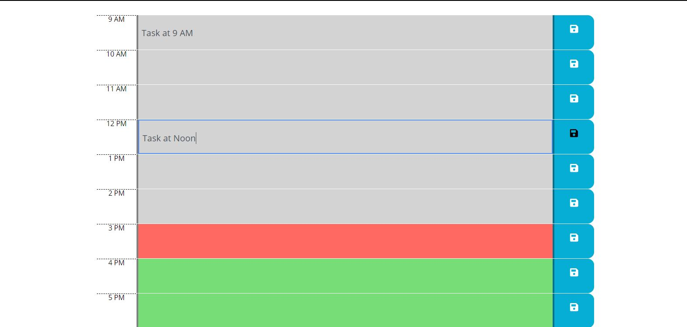

# simpleDailyCalendar
Simple daily calendar is where you can keep track of your daily tasks during the business hours.

The time blocks on the calendar are color-coded. The present hour shows in red color, past hours in grey and future tasks in green color. 

The user can create, edit, or delete a task. The tasks are saved in local-storage so they persist upon page-reload.

